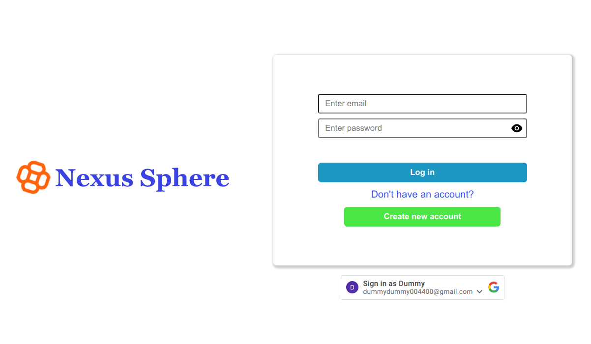
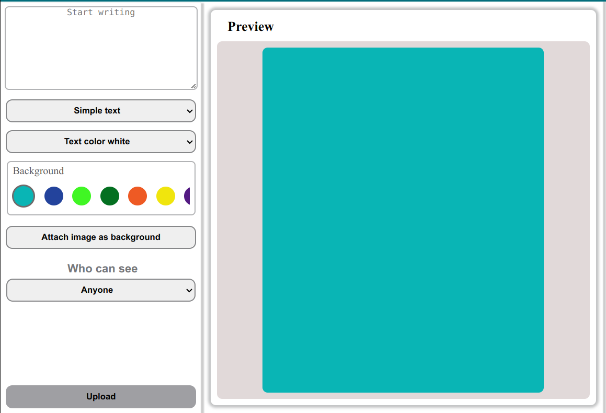

<h1>Nexus Sphere (A Social Media App)</h1> 
<br />
<h3>Links:</h3> <br />

The frontend of the app is hosted on Vercel and the backend is hosted on Render. The database is hosted on MongoDB Atlas. Images and other file are stored on Cloudinary.


<br/>

<b> The live link of the app is: </b>

<p align="center">
  <a href="https://nexus-sphere.vercel.app/">
    
  </a>
</p>


<br/>

<b> Sample Users: </b>
<br/>
These are some sample user accounts using which you can login to the app and see the features.
<br/>


| Serial No | Email                       | Password |
|-----------|-----------------------------|----------|
| 1         | nir@gmail.com               | testN1   |
| 2         | dummydummy004400@gmail.com  | testN1   |
| 3         | webprojecttest63@gmail.com  | testN1   |


<br/>

<b> Youtube demonstration link: </b>
<br/>
<p> A youtube demonstration link of the app is also given below. You can see the demonstration and know the features of the app: </p>
<br/>

<p align="center">
  <a href="https://youtu.be/6fwOk78XaFU?si=CFE05Iq6jhj9pqo9">
    
  </a>
</p>
<br/>
<br/>
<hr/>
<br/>
Nexus Sphere is a comprehensive social media web application designed to provide users with a rich and interactive platform for social networking. It incorporates a wide range of features to enhance user engagement and connectivity.
<br /> <br />
<h3>Feature Details:</h3> <br />
<b>Making Posts:</b> Users can create and share posts with text, images, videos to express themselves and interact with their network.
<br /> <br />
<b>Stories:</b> Similar to popular social media platforms, Nexus Sphere allows users to share temporary stories consisting of photos, videos, or text updates that disappear after a set period.
<br /> <br />
<b>Groups:</b> Users can create or join groups based on common interests, hobbies, or affiliations, fostering community building and discussions within specific topics.
<br /> <br />
<b>Friends:</b> The platform facilitates the establishment and management of friendships, enabling users to connect with others and stay updated on their activities.
<br /> <br />
<b>Chat with Friends:</b> Nexus Sphere includes a built-in messaging feature that allows users to chat with their friends privately, fostering real-time communication and collaboration.
<br /> <br />
<b>User Profiles:</b> Each user has a personalized profile where they can showcase information about themselves, such as bio, profile picture, and interests.
<br /> <br />
<b>Notifications:</b> Users receive  real time notifications for new friend requests, messages and other relevant activities to stay informed and engaged.
<br /> <br />
<b>Search and Discovery:</b> Users can search for other users or groups facilitating content discovery and exploration.
<br /> <br />
<b>Privacy Settings:</b> Nexus Sphere offers customizable privacy settings, allowing users to control who can view their profile, posts, and other activities.
<br /> <br />
<b>Responsive Design:</b> The web application is designed with a responsive layout, ensuring seamless user experience across different devices and screen sizes.
<br /> <br />
<b>Use of Animations:</b> The web application incorporates the use  of animations for better user experiences.
<br /> <br />
<h3>Integrations of Advanced Functionalities:</h3> <br />
<b>Gmail Authentication with OAuth 2.0:</b><br />
Enables users to log in to the platform securely using their Gmail accounts through OAuth 2.0 authentication. This integration provides a seamless and trusted login experience for users, leveraging their existing Gmail credentials without the need to create a separate account.
<br /> <br />
<b>Nested Comment Section with Reply of Comments:</b><br />Implements a hierarchical comment system where users can reply to existing comments, creating nested threads of discussion. This feature enhances engagement by facilitating structured conversations within the comment section of posts. Users can reply directly to specific comments, fostering deeper interactions and discussions.
<br /> <br />
<b>Real-time Comment Update with Server-Sent Event (SSE):</b><br />Utilizes Server-Sent Events (SSE) to provide real-time updates to the comment section without the need for manual refreshing. As users post new comments or replies, SSE enables instant delivery of these updates to all connected clients in a persistent and efficient manner. This ensures that users can view new comments as soon as they are posted, enhancing the interactive nature of the platform.
<br /> <br />
<b>Real-time Notification with Server-Sent Event (SSE):</b><br />Employs Server-Sent Events (SSE) to deliver real-time notifications to users about relevant activities or events on the platform. Notifications can include new friend requests, messages, group invitations or any other noteworthy actions. By receiving instantaneous updates via SSE, users stay informed and engaged with the latest happenings, improving their overall experience.
<br /> <br />
<b>Real-time Chat with Socket.IO:</b><br />Implements a real-time chat feature using Socket.IO, a library for real-time web applications. This feature enables users to engage in instant messaging with friends or contacts within the platform. Socket.IO facilitates bidirectional communication between the client and server, allowing messages to be sent and received in real-time. By this, real time message, reacts on message or even typing during chats can be detected and notified efficiently.
<br /> <br />
<b>Infinite Scrolling in Post, Friend, and Chat Pages:</b><br />Implements infinite scrolling functionality on various pages of the platform, including post feeds, friend lists, and chat conversations. Instead of traditional pagination, where users navigate through pages of content, infinite scrolling dynamically loads additional content as the user scrolls down the page, providing a seamless and uninterrupted browsing experience. This feature enhances user engagement by continuously presenting new content without the need for manual navigation or page reloads, allowing users to effortlessly explore posts, discover new friends, and review chat history with minimal friction.
<br /> <br />
<h3>Tech-Stack Used in the Project:</h3> <br />
<b>Front-End Technology:</b>
<br />

- React JS
- CSS
- Lottie Animations

<br />
<b>Back-End Technology:</b>
<br />

- Node js
- Express js
- cloudinary (to upload files)
- socket io (implementing real time chat feature)

<br />
<b>Database:</b>
<br />

- MongoDB

<br />


<br />
<h3>Local Development:</h3> <br />
You have the flexibility to build the project either locally or with Docker. Building locally involves installing necessary tools and executing build commands, while Docker provides a consistent environment with its Dockerfile and image creation process. 
<br /> <br />
<b>Using Docker:</b><br /><br />
At first come to the base directory of the project and then run the following command in terminal.

```bash
docker compose up -d --build
```

This will build your client and server in docker containers including all necessary dependencies.
<br /><br />

Another way to run the project is to pull the docker images from the dockerhub and run them locally using the following commands. In this method you won't need to build the project locally on your device. Instead just run the following command in the terminal.

```bash
docker pull nirjharsingha/nexus_sphere_server
docker pull nirjharsingha/nexus_sphere_client
docker run -d --name nexus_sphere_server -p 5000:5000 nirjharsingha/nexus_sphere_server
docker run -d --name nexus_sphere_client -p 5173:5173 --link nexus_sphere_server:nexus_sphere_server nirjharsingha/nexus_sphere_client
```

To stop the containers, run the following command in the terminal.

```bash
docker stop nexus_sphere_server nexus_sphere_client
```

To start the containers again, run this command.

```bash
docker start nexus_sphere_server nexus_sphere_client
```

To check the status of your containers, run the following command.

```bash
docker ps -a
```

<span style="color:green">
NB: Your client running in docker container is mapped with port 5173 of your localhost. Your server running in docker container is mapped with port 5000 of your localhost.
</span>
<br />
<br />
You can open your client on this link: 

http://localhost:5173

<b>Without Docker:</b><br /><br />
At first let's build the client locally. Come to the base directory of the project and then run the following command in terminal.

```bash
cd client
npm install --legacy-peer-deps
npm run dev
```

This will start your react development server. To build your react client project, you can run this command:

```bash
npm run build
```

Now let's build the backend server locally. Come to the base directory of the project and then run the following command in terminal.

```bash
cd server
npm install
npm start
```

This will start your node js backend server.<br/>
Your backend server will be running on port 5000.

You can open your app on this link: 

http://localhost:5173

<span style="color:green">
NB: Whether you build the app with docker or without docker, your MongoDB database will be on mongodb atlas and you will need internet connection to communicate with database. By this you can access the already present sample data of the database. For connecting with database, all required credentials defined in .env file is also pushed on github as there is no sensitive data on the database and without this, one cannot access the database and some other services. You can connect a local database as well but in that case that database will be empty initially.
</span>
<br /><br />

<h3>Some images of the project:</h3> <br />

<p align="center">
  
</p>

<p align="center">
  
</p>

<p align="center">
  
</p>

<p align="center">
  
</p>

<p align="center">
  
</p>

<p align="center">
  
</p>

<p align="center">
  
</p>

<p align="center">
  
</p>

<p align="center">
  
</p>

<p align="center">
  
</p>

<p align="center">
  
</p>

<p align="center">
  
</p>

<p align="center">
  
</p>

<p align="center">
  
</p>

<p align="center">
  
</p>

<br/><br/>

Nexus Sphere is a feature-rich social media web application designed to offer users an immersive platform for social networking. With a focus on user engagement and connectivity, it provides a wide array of functionalities such as making posts, sharing stories, creating or joining groups, managing friendships, and engaging in private chats. The platform also offers personalized user profiles, real-time notifications, and customizable privacy settings to enhance user experience and security. Additionally, Nexus Sphere integrates advanced features including Gmail authentication via OAuth 2.0, nested comment sections with reply functionality, real-time updates using Server-Sent Events (SSE), and a Socket.IO-powered real-time chat feature. With a responsive design, seamless animations, and infinite scrolling for effortless content exploration, Nexus Sphere offers a modern and dynamic social media experience for users. Powered by technologies such as React JS, Node.js, Express.js, and MongoDB, Nexus Sphere ensures a robust and scalable solution for social networking needs.